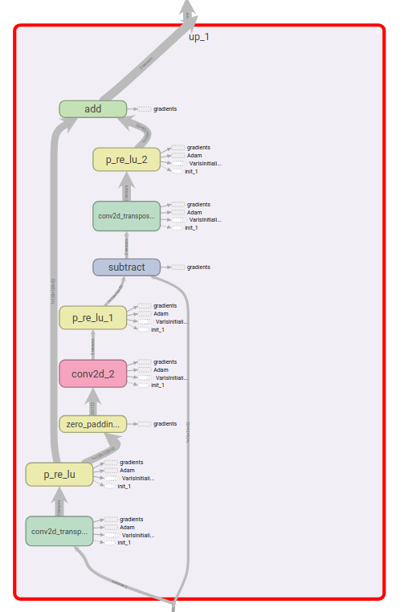
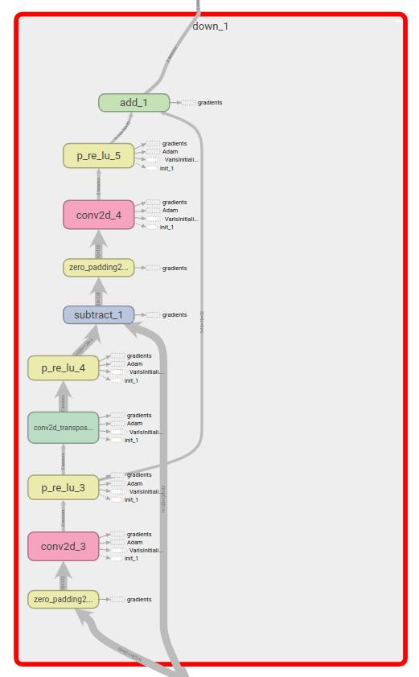
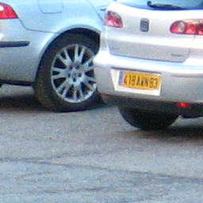
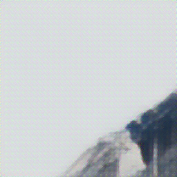
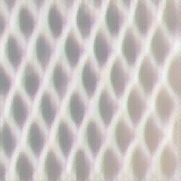
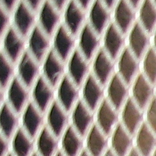
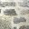

# Deep BackProjection Networks for Image Super Resolution

Unofficial Tensorflow implementation of DBPN CVPR 2018.

## Whats DBPN?

- One of the Deep Super-resolution networks that learn **representations** of low-res inputs, and the **non linear mapping** to high-res output.
- This network exploits iterative up and down convolution layers thereby providing a negative feedback mechanism for projection errors at each stage.
- Stacking of each up and down sampling stage in this fasion is **DBPN**.
- Concatenation of all other previous feature layers with the current layer lead to the **Dense** version of DBPN. This is proven to have performance enhancements. 

## Whats New?

- We have added [**Perceptual Loss**](https://arxiv.org/abs/1603.08155) which is generally used for Realtime style transfer and super resolution.
- This loss emphasizes on **optimization of high level features**,  learnt in pre trained networks (VGG16 used here, support can be extended), to be reconstructed by our network.
- We have used only **Feature Reconstruction Loss** of perceptual loss for training purposes. **Style Transfer Loss** is implemented though.
- Total Loss function

    f: Non Linear Mapping (DBPN)
    g_j: Pre-trained Network layer j

## How to use this?

|Code|Utilities|Run Command|
---|---|---
dbpn_lite.py| Implementation of DBPN with no dense connections. It has implementations of various scales **2x, 4x, 8x**. It contains utility functions and model definitions.|
main.py | Main training program | `python main.py --no_epoch 10000 --batch_size 8 --train_dir <path to train dataset>`

Training dataset for DBPN is only a **folder full of HR images**. LR down conversion is taken care by the [**input pipeline**](https://github.com/tlokeshkumar/tf-data-input-pipeline).  

#### Up Projection Block

#### Down Projection Block

## Sample Outputs (8x)

|Input LR| Predicted HR| True HR|
-|-|-|
|||
|||
|||
|||
|||

